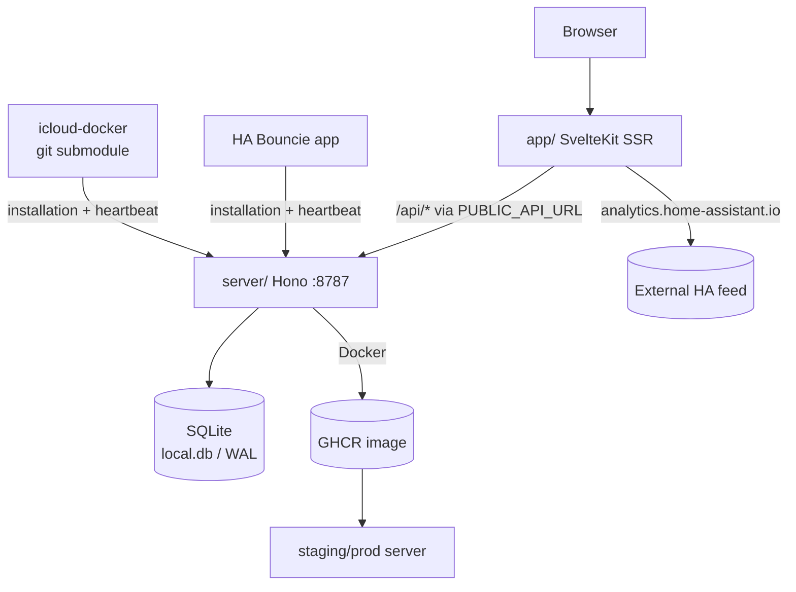

# Architecture — Cross-Cutting Design

## Architecture Style

WAPAR is a **two-tier, layered monolith** split across two TypeScript workspaces:

```
┌─────────────────────────────── app/ (SvelteKit) ───────────────────────────────┐
│  +page.server.ts ── SSR fetch ──▶ lib/*.ts transforms ──▶ components/charts      │
└───────────────┬────────────────────────────────────────────────────────────────┘
                │  HTTP (PUBLIC_API_URL)
┌───────────────▼────────────────────────────────────────────────────────────────┐
│  server/ (Hono)                                                                │
│  index.ts (middleware, error handling, routes)                                 │
│    └─ routes/*.ts          ── zod validation ──▶ utils/ (classification…)      │
│    └─ db/ (Drizzle schema + migrations)                                         │
│    └─ local.ts (Bun.serve + SQLite PRAGMAs) ◀── bun:sqlite ──▶ local.db         │
└───────────────────────────────┬────────────────────────────────────────────────┘
                                │ (via D1-compatible shim)
                     SQLite file (WAL, single-writer)
```

- **Server**: layered (routes → utils/services → db). Each route module is thin; analytics logic lives in `server/src/utils/*`.
- **App**: SSR-request → pure transform functions → presentational components in `app/src/lib/components/ui/`.
- There is **no message queue, no cache tier, no separate DB node** — one SQLite file, one HTTP API.

## Deployment Topology

| Environment | Server | App | Data |
|---|---|---|---|
| Local dev | `./run.sh` / `bun run dev` (port 8787) | `bun dev` (5173) | `server/local.db` |
| Docker | `docker compose up` (dev, volume mounts) or `docker-compose.prod.yaml` | same image as server | `/data/local.db` volume |
| Staging/prod | GHCR image, `wapar-api.mandarons.com` (reverse proxy) | SvelteKit SSR build | `/data/local.db` |

- Env vars: `DB_PATH` (DB location), `ACTIVITY_THRESHOLD_DAYS` (classification), `DRIZZLE_LOG`, `ENABLE_TEST_ROUTES`, `PUBLIC_API_URL` (app), `PORT`. See `server/docs/LOCAL_DEVELOPMENT.md` and `server/DOCKER.md`.
- CI: staging on PR, production on `main` + hourly cron; gates: server 100% coverage (lcov), `bunx drizzle-kit check`, Docker build to GHCR. Deploy docs in `.github/workflows/*.yml`.

### Diagram (Mermaid)



## Cross-Cutting Concerns

| Concern | Where | Notes |
|---|---|---|
| Logging | `server/src/utils/logger.ts` | Structured logs with request context; `measureOperation` for timings. Never log secrets. |
| Error handling | `server/src/index.ts` `app.onError` + `routes/*` | Zod → 400 envelope; JSON parse errors → 400; generic → 500 via `handleGenericError`. |
| Config | env vars (listing above) | No config files; defaults baked in (e.g., threshold 3). |
| Migrations | `server/src/db/migrations.ts` middleware | Applied on first request; failure is logged, request continues. Dev: `db:push`; prod: `db:generate` + `db:migrate`. |
| Performance | `server/src/local.ts` PRAGMAs + `schema.sql` indexes | WAL, busy_timeout 5s, 64MB cache; indexes on all query-filter columns (see `docs/standards/performance.md`). |
| Security | middleware; `POST /api` test-SQL localhost-gated | See `docs/standards/security.md`. |
| Feature flags | `ENABLE_TEST_ROUTES` (server); none in app | Keep minimal. |

## Related

- `docs/index.md` (top-level map), `docs/systems/server.md`, `docs/systems/app.md`.
- `docs/adr/` — the "why" for the topology: local SQLite shim, Bun server + test runner, text-UUID schema.
- `server/docs/LOCAL_DEVELOPMENT.md`, `server/DOCKER.md` — operational deep dives.